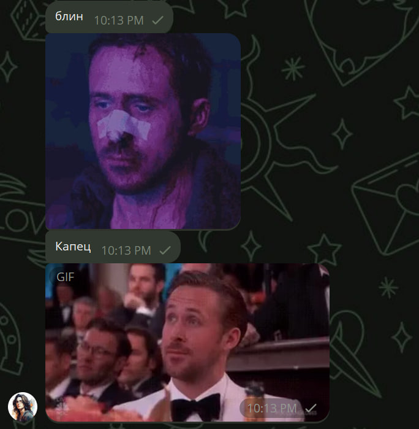

# Gosling, blin


## Description

This project sends gifs of Ryan Gosling every time you (or anybody else) say "блин" or "капец" in Telegram chat/dialog.  
It also has a 10% chance of sending pancakes.  

## Installation

First, copy template.env file as .env; set your parameters as shown here https://docs.telethon.dev/en/stable/basic/signing-in.html. Then you can run the docker image:

```bash
bash run_gosling.sh